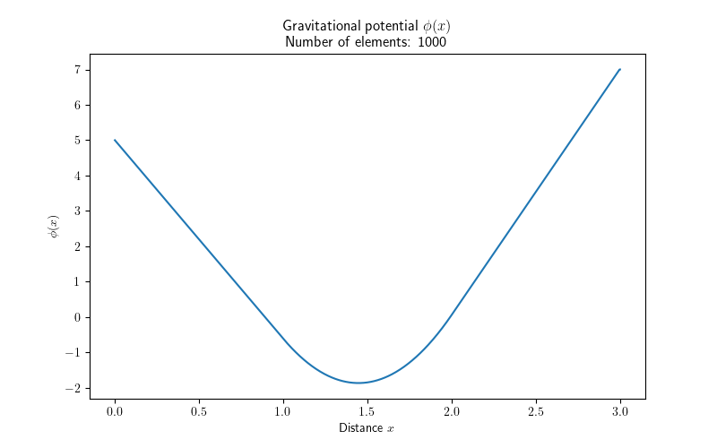

# Gravitational potential FEM
### Final project of differential equations course at AGH University 2023/2024

#### Problem:
<p align="center">
  
</p>

#### Problem solution:
[Gravitational Potential Solution](GravitationalPotentialSolution.pdf)

#### Depentencies:
- python 3.10
- scipy 1.10.0
- numpy 1.24.3
- matplotlib 3.7.1
- tkinter 8.6

#### Solution for 1000 elements:
<p align="center">
  
</p>

#### Usage:
```
python3.10 main.py
```